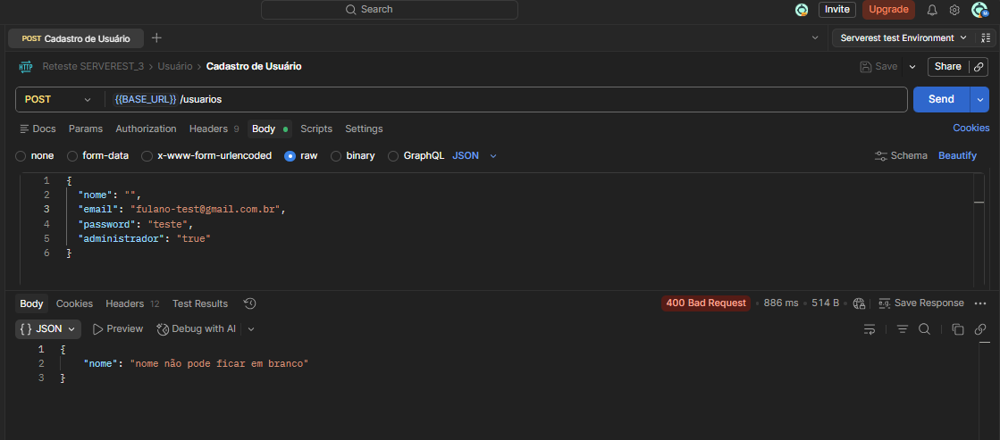
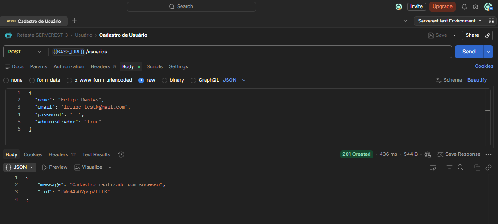
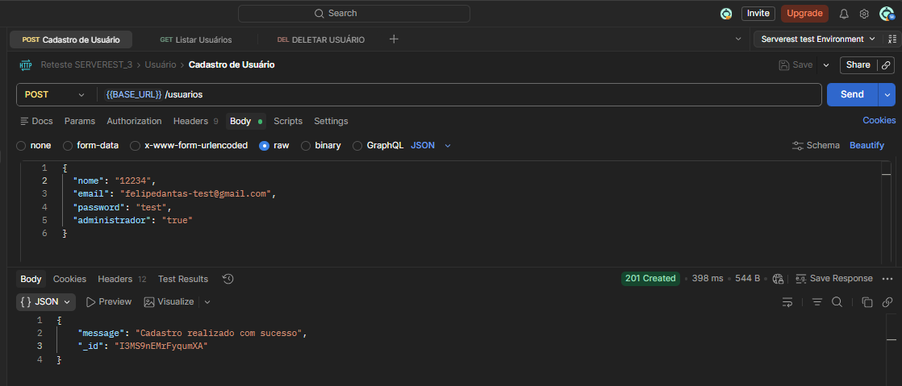
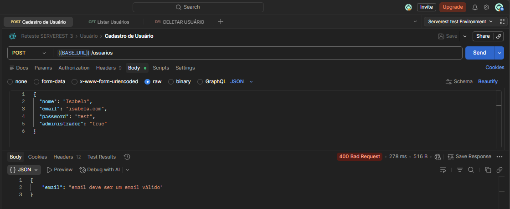

## Fluxo Alternativo

### TC01 - POST - Cadastrar Usuário sem Informar Nome
**ID:** API_POST_USER_001

**Título:** Validar cadastro sem preenchimento do campo nome

**Método:** POST

**Endpoint:** /usuarios

### Regra de Negócio 

O sistema deve permitir o cadastro de usuários apenas quando todos os campos obrigatórios 
estiverem preenchidos com dados válidos e no formato esperado.

### Passos
1. Deixar campo nome em branco.

### Input (body)
{  
“name” : “”,  
“e-mail” “nicole@gmail.com”,  
“password” :  “1234”,  
}  

### Resultado Esperado 
Status code **400**

O sistema não deve permitir o cadastro 

Deve exibir uma mensagem de erro informando que o campo **Nome é obrigatório.**

### Resultado Obtido
Status code **400**

Mensagem de erro obtida **“Nome não pode ficar em branco”.**

**Status:** Pass   
## Evidência
  

### TC02 - POST - Cadastrar Usuário sem Informar E-mail 
**ID:** API_POST_USER_002

**Título:**  Validar cadastro sem preenchimento do campo e-mail

**Método:** POST

**Endpoint:** /usuarios

### Regra de Negócio 
O sistema deve permitir o cadastro de usuários apenas quando todos os campos obrigatórios 
estiverem preenchidos com dados válidos e no formato esperado.

### Passos
1. Deixar campo e-mail em branco

### Input (body)
{  
“name” : “ Nicole ”,  
“e-mail” “    ”,  
“password” : “1234”,  
}  

### Resultado Esperado 
Status code **400**

O sistema não deve permitir o cadastro 

Deve exibir uma mensagem de erro informando que o campo **E-mail é obrigatório.**

### Resultado Obtido
Status code **400**

Mensagem de erro exibida **“E-mail deve ser um e-mail válido”**

**Status:** Pass   
## Evidência
  

### TC03 - POST - Cadastrar Usuário sem Informar Senha
**ID:**  API_POST_USER_003

**Título:** Validar cadastro sem preenchimento do campo senha

**Método:** POST

**Endpoint:** /usuarios

### Regra de Negócio 
O sistema deve permitir o cadastro de usuários apenas quando todos os campos obrigatórios 
estiverem preenchidos com dados válidos e no formato esperado.

### Passos
1. Deixar campo senha em branco

### Input (body)
{  
“name” : “ Nicole ”,  
“e-mail” “ nicole@gmail.com ”,  
“password” : “”,  
}  

### Resultado Esperado 
Status code **400**

O sistema não deve permitir o cadastro 

Deve exibir uma mensagem de erro informando que o campo **Senha é obrigatório.**

### Resultado Obtido
Status code **201 - Created**  
Usuário cadastrado com sucesso  

**Status:** Fail  

**Bug Relacionado:** BUG02_API_permite_cadastro_com_senha_composta_apenas_por_espaço_em_branco.md  

**Severidade** 
Alta  

**Prioridade**  
Alta  

## Evidência
  

### TC04 - POST - Cadastro Informando Números no Campo Nome
**ID:**  API_POST_USER_004

**Título:** Validar cadastro com caracteres numéricos no campo nome

**Método:** POST

**Endpoint:** /usuarios

### Regra de Negócio 
O sistema deve permitir o cadastro de usuários apenas quando todos os campos obrigatórios 
estiverem preenchidos com dados válidos e no formato esperado.

### Passos
1. Preencher o campo **Nome** com números (ex:12345)

### Input (body)
{  
“name” : “ 7712 ”,  
“e-mail” “ nicole@gmail.com ”,  
“password” : “1234”,  
}  

### Resultado Esperado 
O sistema deve aceitar string no campo nome

### Resultado Obtido
Status code **201**

Sistema permitiu o cadastro com números no campo nome 

Cadastro criado com sucesso 

ID gerado 

**Status:** Pass  

### Observação 
O campo nome aceita valores numéricos. Não há regra clara na API indicando restrição de formato. Validar com o time se esse comportamento é esperado. 

## Evidência
  

### TC05 - POST- Cadastro com E-mail em Formato Inválido
**ID:**  API_POST_USER_005

**Título:** Validar cadastro com e-mail em formato inválido

**Método:** POST

**Endpoint:** /usuarios

### Regra de Negócio
O sistema deve permitir o cadastro de usuários apenas quando todos os campos obrigatórios 
estiverem preenchidos com dados válidos e no formato esperado.

### Passos
1. Preencher o campo E-mail com um valor em formato inválido (ex: mariasilva.com.br, 
mariasilva.br, mariasilva.com)

### Input (body)
{  
“name” : “ Nicole ”,  
“e-mail” “ nicole.com ”,  
“password” : “1234”,  
}  

### Resultado Esperado 
Status code **400**

O sistema não deve permitir o cadastro 

Deve exibir uma mensagem de erro informando que o formato do e-mail é inválido 

### Resultado Obtido
Status code **400** 

Mensagem de erro obtida: **“E-mail deve ser um e-mail válido”.**

**Status:** Pass   

## Evidência

