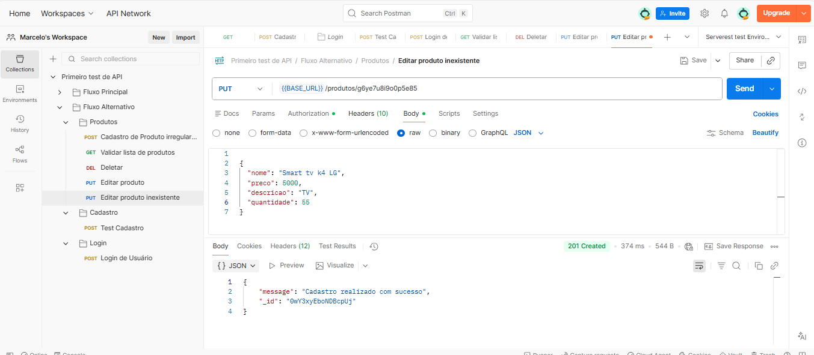

## Fluxo Alternativo

### TC - PUT - Alterar Produto Com ID Inexistente
**ID:** API_PUT_PROD_001

**Título:** Validação de erro para Id inexistente

**Método:** PUT

**Endpoint:** /produtos/ { Id }

### Regra de Negócio 

O sistema não deve permitir a alteração de produtos inexistentes.

### Passos
1. Enviar request PUT com um ID inexistente.

### input (body)
{ 
"title": "TV 4K LG ", 
"price": 3000, 
"description": " Tv ", 
"Id": 12**5166@$&&@156, 
} 

### Resultado Esperado 
Status code **404**

O sistema não deve permitir a alteração de um produto inexistente 

Sistema deve exibir mensagem informando que o produto não foi localizado

### Resultado Obtido
Status code **201 - Created**

Sistema permitiu a operação 

Exibiu a mensagem **“ Cadastro realizado com sucesso “**

Um novo produto foi criado ignorando o ID inexistente informado na URL

### Observação
O método PUT está se comportando como POST, permitindo a criação de um novo produto ao 
invés de bloquear a alteração de um recurso inexistente.

Comportamento em desacordo com a regra de negócio e com o padrão REST.

**Status:** BUG  

**Severidade:**  
Média

## Evidência

  

