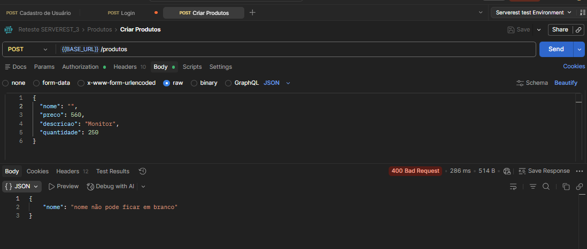
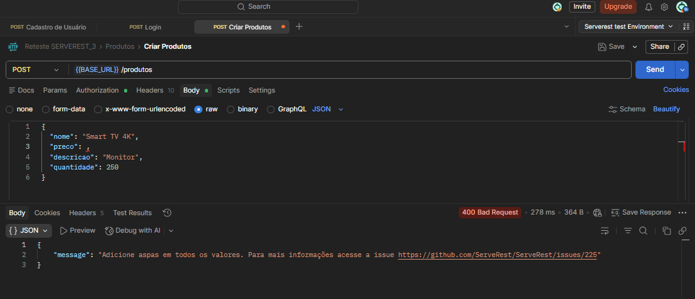
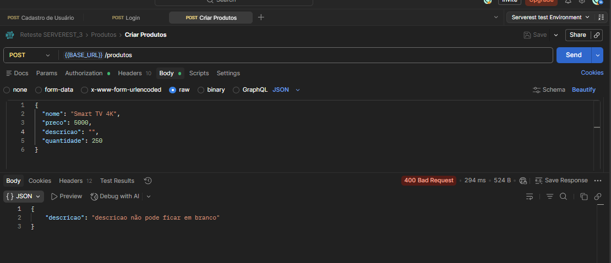
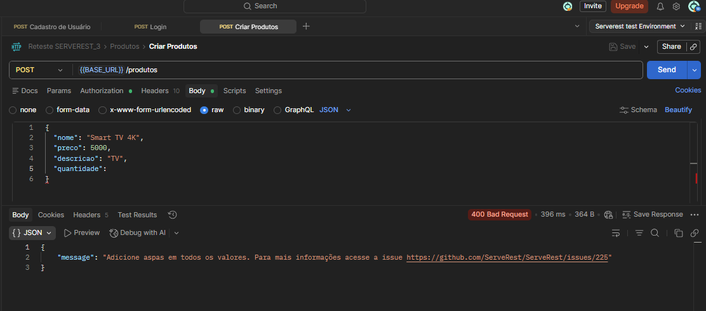

## Fluxo Alternativo

### TC01 - POST - Não Colocar Nome
**ID:** API_POST_PROD_002

**Título:** Validar erro ao cadastrar produto sem nome

**Método:** POST

**Endpoint:** /produtos

### Regra de Negócio 

O sistema não deve permitir o cadastro de produtos sem informar os campos obrigatórios.

### Passos
1. Enviar request POST sem o campo nome.

### Input (body)
{  
"title": "  ", 
"price": 100, 
"description": "A description", 
"quantity": 58, 
}  

### Resultado Esperado 
Status code **400**

Retornar mensagem de erro solicitando o nome

Produto não deve ser cadastrado 

### Resultado Obtido
Status code **400**

Sistema retornou a mensagem de “ nome é obrigatório “ e cadastro não foi realizado

**Status:** Pass   

## Evidência
  

### TC02 - POST - Não Colocar Preço
**ID:** API_POST_PROD_003

**Título:** Validar erro ao cadastrar produto sem preço

**Método:** POST

**Endpoint:** /produtos

### Regra de Negócio 
O sistema não deve permitir o cadastro de produtos sem informar os campos obrigatórios.

### Passos
1. Enviar request POST sem o campo preço.

### Input (body)
{  
"title": " Teclado sem fio ", 
"price":   , 
"description": "Teclado", 
"quantity": 58, 
}  

### Resultado Esperado 
Status code **400**

Retornar mensagem de erro solicitando o preço

Produto não deve ser cadastrado 

### Resultado Obtido
Status code **400**

Sistema retornou a mensagem de “ preço é obrigatório “ e cadastro não foi realizado

**Status:** Pass   

## Evidência
  

### TC03 - POST - Não Colocar Descrição
**ID:** API_POST_PROD_004

**Título:** Validar erro ao cadastrar produto sem descrição

**Método:** POST

**Endpoint:** /produtos

### Regra de Negócio 
O sistema não deve permitir o cadastro de produtos sem informar os campos obrigatórios.

### Passos
1. Enviar request POST sem o campo descrição.

### Input (body)
{  
"title": " Teclado sem fio ", 
"price": 250, 
"description": "   ", 
"quantity": 58, 
}  

### Resultado Esperado 
Status code **400**

Retornar mensagem de erro solicitando descrição

Produto não deve ser cadastrado 

### Resultado Obtido
Status code **400** 

Sistema retornou a mensagem de “ descrição é obrigatória “ e cadastro não foi realizado

**Status:** Pass   
## Evidência
  

### TC04 - POST - Não Colocar Quantidade
**ID:** API_POST_PROD_005

**Título:** Validar erro ao cadastrar produto sem quantidade

**Método:** POST

**Endpoint:** /produtos

### Regra de Negócio 
O sistema não deve permitir o cadastro de produtos sem informar os campos obrigatórios.

### Passos
1. Enviar request POST sem o campo quantidade.

### Input (body)
{  
"title": " Teclado sem fio ", 
"price": 250, 
"description": " Teclado ", 
"quantity":  , 
}  

### Resultado Esperado 
Status code **400**

Retornar mensagem de erro solicitando quantidade

Produto não deve ser cadastrado 

### Resultado Obtido
Status code **400**

Sistema retornou a mensagem de “ quantidade é obrigatória “ e cadastro não foi realizado

**Status:** Pass   
## Evidência
  
