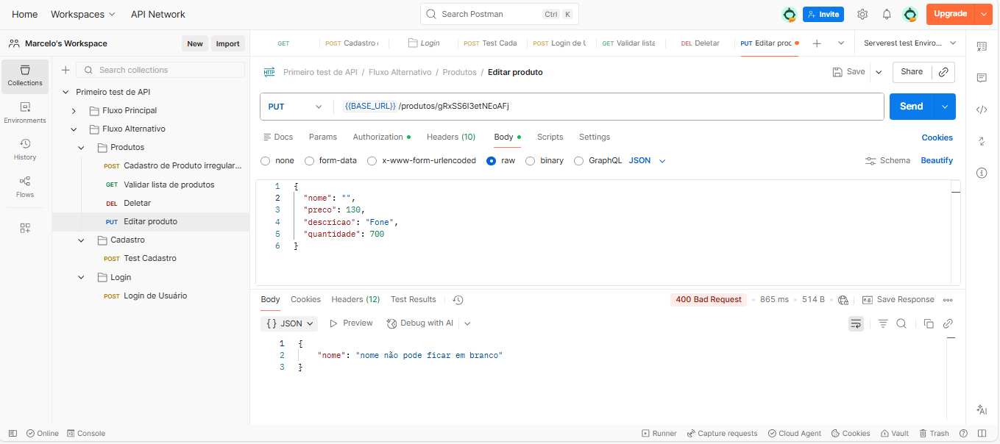
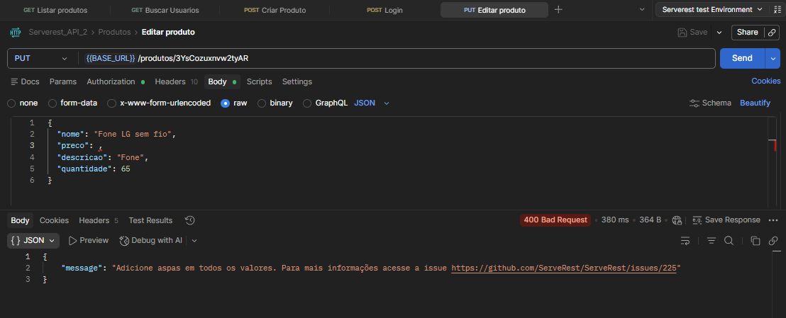
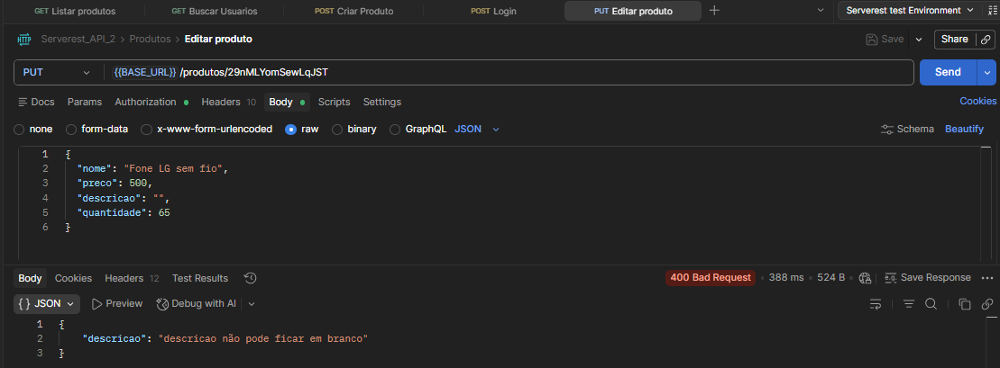
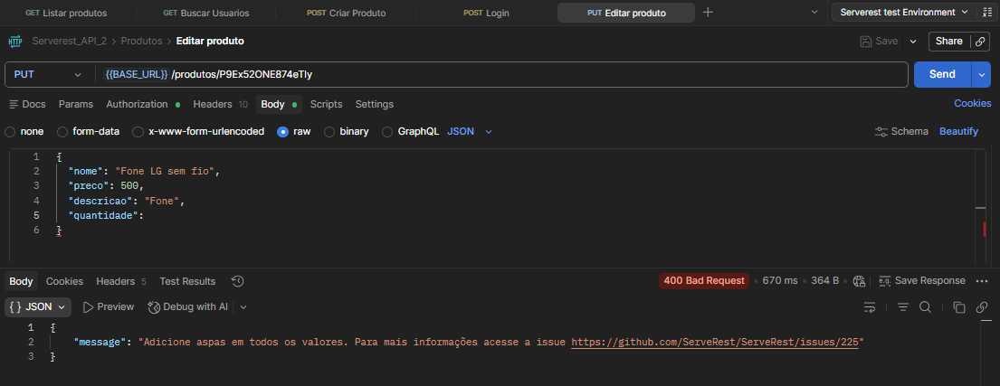

## Fluxo Alternativo

### TC01 - PUT - Não Colocar Nome
**ID:** API_PUT_PROD_001

**Título:**  Validar erro ao alterar produto sem informar o nome

**Método:** PUT

**Endpoint:** /produtos/ { Id }

### Regra de Negócio 

O sistema deve permitir a alteração de produtos apenas quando os campos obrigatórios 
estiverem preenchidos.

### Passos
1. Enviar request PUT para endpoint /produtos {id} sem o nome.

### Input (body)
{ 
"title": "  ", 
"price": 5000 , 
"description": " Descrição ", 
"quantity": 35, 
} 

### Resultado Esperado 
Status code **400**

Retornar mensagem de erro solicitando o nome

Produto não deve ser alterado

### Resultado Obtido
Status code **400**

Sistema retornou a mensagem de **“ nome não pode ficar em branco“** e alteração não foi realizada

**Status:** PASS   

### Evidência 
  

### TC02 - PUT - Não Colocar Preço
**ID:** API_PUT_PROD_002

**Título:**  Validar erro ao alterar produto sem informar o preço

**Método:** PUT

**Endpoint:** /produtos/ { Id }

### Regra de Negócio 

O sistema deve permitir a alteração de produtos apenas quando os campos obrigatórios 
estiverem preenchidos.

### Passos
1. Enviar request PUT para endpoint /produtos {id} sem o preço.

### Input (body)
{ 
"title": "Fone LG sem fio ", 
"price":  , 
"description": "Fone", 
"quantity": 65, 
} 

### Resultado Esperado 
Status code **400**

Retornar mensagem de erro solicitando o preço

Produto não deve ser alterado

### Resultado Obtido
Status code **400**

Alteração não foi realizada

**Status:** PASS   
### Evidência
  

### TC03 - PUT - Não Colocar Descrição
**ID:**  API_PUT_PROD_003

**Título:**  Validar erro ao alterar produto sem informar a descrição

**Método:** PUT

**Endpoint:** /produtos/ { Id }

### Regra de Negócio 

O sistema deve permitir a alteração de produtos apenas quando os campos obrigatórios 
estiverem preenchidos.

### Passos
1. Enviar request PUT para endpoint /produtos/{id} sem a descrição.

### Input (body)
{ 
"title": "Fone LG sem fio ", 
"price": 500, 
"description": "", 
"quantity": 65, 
} 

### Resultado Esperado 
Status code **400**

Retornar mensagem de erro solicitando a descrição

Produto não deve ser alterado

### Resultado Obtido
Status code **400**

Sistema retornou a mensagem de **“ descrição é obrigatória “** e alteração não foi realizada

**Status:** PASS   
### Evidência
  

### TC04 - PUT - Não Colocar Quantidade
**ID:**  API_PUT_PROD_004

**Título:**  Validar erro ao alterar produto sem informar a quantidade

**Método:** PUT

**Endpoint:** /produtos/ { Id }

### Regra de Negócio 

O sistema deve permitir a alteração de produtos apenas quando os campos obrigatórios 
estiverem preenchidos.

### Passos
1. Enviar request PUT para endpoint /produtos/{id} sem a quantidade.

### Input (body)
{ 
"title": "Fone LG sem fio ", 
"price": 500, 
"description": "Fone", 
"quantity": , 
} 

### Resultado Esperado 
Status code **400**

Retornar mensagem de erro solicitando a quantidade

Produto não deve ser alterado

### Resultado Obtido
Status code **400**

Alteração não foi realizada

**Status:** PASS   
### Evidência
  

