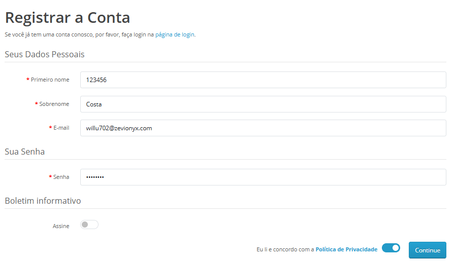

### ID do BUG: BUG01_Criação_Aprovada_Pelo_Sistema
Título: Sistema permite cadastro com números e símbolos nos campos "Nome" e "Sobrenome"   

Tipo: BUG Funcional  
Ferramenta usada: Teste Manual (Navegador)  
Módulo: Cadastro de Usuário  
Tipo de teste: Teste Funcional Manual   

**Ambiente**  

Ambiente: Aplicação web de testes  
Ferramenta: Navegador (edge)  
Data do teste: 20/03/2026   

**Pré-condição**  

Usuário acessar a página de cadastro do site.   

**Passos para Reproduzir**  

1. Acessar a página de cadastro.  

2. No campo "Nome", inserir números e/ou símbolos (exemplo: 123 ou João@).  

3. Preencher os demais campos obrigatórios corretamente.  

4. Clicar em "Cadastrar".   

**Resultado Esperado**  
O sistema deveria validar os campos "Nome" e "Sobrenome" e exibir mensagem informando que apenas letras são permitidas.  

**Resultado Obtido**  
O sistema permitiu a criação do cadastro utilizando números e símbolos nos campos "Nome" e "Sobrenome".  

**Observação Adicional**  
Campos de identificação do usuário normalmente possuem regras de validação para garantir a integridade dos dados cadastrados.
A ausência dessa validação pode permitir o registro de dados inconsistentes no sistema e impactar processos que dependem dessas informações.  

**Severidade**  
Média   

## Evidência  
**BUG**  
  
  

