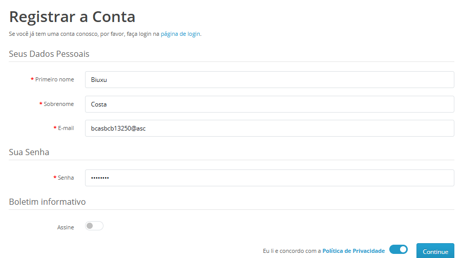

## Feature: TC_REGISTRATION_001 - Cadastro de Usuário com Credenciáis válidas

Ambiente: Web/Edge/Windows

Pré-condição:  Usuário acessar página inicial da Opencart
Passos:
1. Clicar em minha conta 
2. Clicar em cadastrar 
3. Preencher dados válidos solicitados nos campos obrigatórios    
**Regra de Negócio**

O sistema deve permitir a criação de uma conta apenas quando todos os campos obrigatórios 
(Nome, Sobrenome, E-mail e Senha) forem preenchidos com dados válidos, respeitando as 
regras de validação definidas para cada campo.      

Testes Funcionais - Fluxo Principal   

**TC_001.** Inserir nome válido no campo "Nome"   
**Resultado esperado:** Sistema aceita o nome e permite continuar o cadastro.  

**Resultado Obtido:** Sistema aprovou o cadastro.  

**Status: PASS**   

**TC_002.** Inserir sobrenome válido no campo "Sobrenome"   

**Resultado esperado:** Sistema aceita o sobrenome e permite continuar o cadastro.  

**Resultado Obtido:** Sistema aprovou o cadastro. 

**Status: PASS**   

**TC_003.** Inserir e-mail válido no campo "E-mail"  

**Resultado esperado:** Sistema aceita e-mail válido e permite continuar o cadastro.  

**Resultado Obtido:** Sistema aprovou o cadastro.  

**Status: PASS**   

**TC_004.** Inserir senha com caracteres válidos  

**Resultado esperado:** Sistema aceita senha válida e conclui o cadastro.  

**Resultado Obtido:** Sistema aprovou o cadastro.  

**Status: PASS**   

## Evidências  

Evidências coletadas durante a execução do teste:  

 **Sucesso**
   

Fluxo Alternativo   

**TC_005.** Deixar o campo "Nome" em branco  

**Resultado esperado:** Sistema deve exibir mensagem informando que o campo é obrigatório.  

**Resultado Obtido:** Sistema exibiu mensagem solicitando preenchimento do campo 
obrigatório.  

**Status: PASS**   

**TC_006.** Deixar o campo "Sobrenome" em branco  

**Resultado esperado:** Sistema deve exibir mensagem informando que o campo é obrigatório.  

**Resultado Obtido:**  Sistema exibiu mensagem solicitando preenchimento do campo 
obrigatório.  

**Status: PASS**   

**TC_007.** Deixar o campo "Senha" em branco  

**Resultado esperado:** Sistema deve exibir mensagem informando que o campo é obrigatório.  

**Resultado Obtido:**  Sistema exibiu mensagem solicitando preenchimento do campo 
obrigatório.  

**Status: PASS**   

Validação de Campos   

**TC_008.** Inserir números e símbolos nos campos "Nome" e "Sobrenome"  

**Resultado esperado:** Sistema deve exibir mensagem informando que apenas letras são 
permitidas.  

**Resultado Obtido:**  Sistema permitiu a criação de cadastro utilizando números e símbolos.  

**Status: BUG**  

**Severidade:** Média  

**Prioridade:** Média   

## Evidência  

**BUG**  
   
   

**TC_009.** Inserir e-mail inválido no campo "E-mail"  

**Resultado esperado:** O sistema deve exibir uma mensagem de erro informando que o e-mail 
inserido é inválido e solicitar a inserção de um e-mail válido.  

**Resultado Obtido:**  Sistema não exibiu mensagem de erro e não concluiu o cadastro.  

**OBS:** Foi observado que, ao inserir um e-mail inválido no campo "E-mail", o sistema não 
apresenta nenhuma mensagem de validação ao usuário. A ausência de feedback pode gerar 
dúvida sobre o motivo pelo qual o cadastro não foi concluído. Recomenda-se a implementação 
de uma mensagem clara informando que é necessário inserir um e-mail válido para prosseguir 
com o cadastro.  

**Status: FAIL**   

## Evidências  

**Erro** 
   

**TC_010.** Inserir senha com apenas 1 caractere (ex: A ou 1)  

**Resultado esperado:** Sistema não deve permitir a criação do cadastro e deve exibir mensagem informando requisitos mínimos de senha.  

**Resultado Obtido:** Sistema não aprovou a criação do cadastro sem os requisitos mínimos.  

**Status: PASS**   

