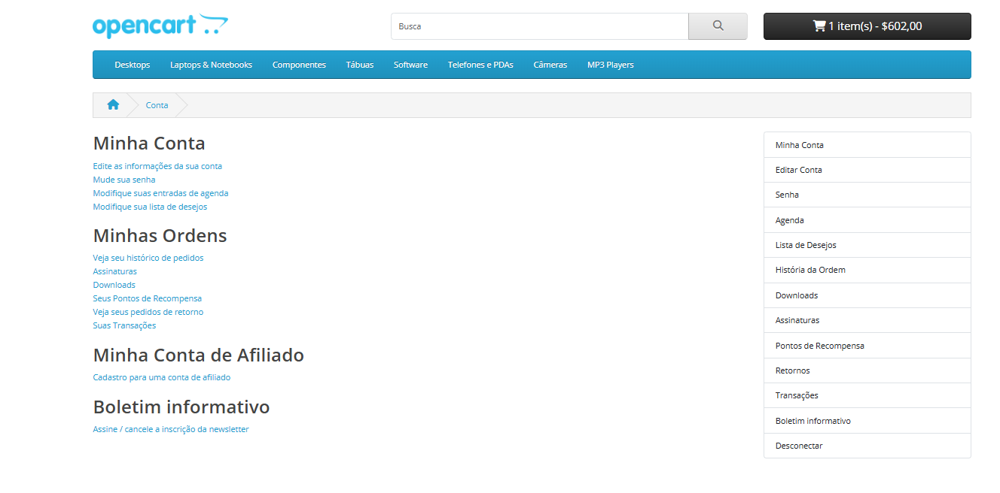

## Feature: Login de Usuário

Ambiente: Web/Edge/Windows

Pré-condição: Usuário acessar área de login da Opencart.  

Passos:
1.  Acessar site da Opencart
2.  Clicar em minha conta
3.  Clicar em entrar
4.  Informar e-mail válido previamente cadastrado no campo "E-mail" (ex: vitoria@gmail.com)
5.  Informar senha válida no campo "Senha" (ex: Entrar123*)
6.  Marcar o checkbox "Política de Privacidade"
7.  Marcar o checkbox "Sou Humano"
9.  Clicar em "Entrar"

**Regra de Negócio**

O sistema deve permitir o acesso à conta apenas quando o usuário informar credenciais válidas 
(e-mail e senha cadastrados corretamente), bloqueando o login e exibindo mensagem 
apropriada quando as informações forem inválidas ou estiverem incompletas.      

Testes Funcionais - Fluxo Principal   

**TC_001.** Realizar login com credenciais válidas (e-mail e senha cadastrados)  

**Resultado Esperado:** Sistema deve aceitar e autenticar o usuário e permitir acesso à conta sem exibir nenhuma mensagem de erro.  

**Resultado Obtido:** Sistema autenticou o usuário com sucesso, redirecionando para a página "Minha Conta".  

**Status: PASS**   

## Evidência  

   

Fluxo Alternativo   

**TC_002.** Inserir e-mail inválido no campo e-mail  

**Resultado Esperado:** Sistema não deve autenticar o login e deve exibir mensagem de erro informando que o e-mail ou senha 
são inválidos.  

**Resultado Obtido:** Sistema não autenticou o login e exibiu mensagem "não há correspondência para e-mail ou senha", impedindo acesso a conta.  

**Status: PASS**   

**TC_003.** Inserir senha inválida no campo senha  

**Resultado Esperado:** Sistema deve autenticar o login, deve exibir mensagem de erro informando que o e-mail ou senha 
são inválidos.  

**Resultado Obtido:** Sistema não autenticou o login e exibiu mensagem "não há correspondência para e-mail ou senha".  

**Status: PASS**   

Validação de campos   

**TC_004.** Tentar realizar login com campo e-mail vazio  

**Resultado Esperado:** Sistema não deve autenticar o usuário quando o campo e-mail estiver 
vazio e deve exibir mensagem informando que os dados são inválidos ou obrigatórios.  

**Resultado Obtido:**  Sistema não permitiu o login com o campo e-mail vazio e exibiu mensagem 
de erro informando que não há correspondência para e-mail ou senha impedindo o acesso.  

**Status: PASS**   

**TC_005.** Tentar realizar login com campo senha vazio  

**Resultado Esperado:** Sistema não deve autenticar o usuário quando o campo senha estiver 
vazio e deve exibir mensagem informando que os dados são inválidos ou obrigatórios.  

**Resultado Obtido:**  Sistema não permitiu o login com o campo senha vazio e exibiu mensagem 
de erro informando que não há correspondência para e-mail ou senha impedindo o acesso. 

**Status: PASS**   

Teste de Segurança / Regra de Proteção de Conta   

**TC_006.** Verificar limite de tentativas de login com senha incorreta (proteção contra múltiplas 
tentativas)  

**Resultado Esperado:** Após 5 tentativas consecutivas de login com senha incorreta, o sistema 
deve bloquear temporariamente a conta e notificar o usuário por e-mail sobre a atividade 
suspeita e perguntar se foi o mesmo quem efetuou as tentativas.  

**Resultado Obtido:** Sistema não limita a quantidade de tentativas de login com senha incorreta, 
permitindo tentativas ilimitadas.  

**Obs:** Com a ausência desse bloqueio temporário o usuário corre alto risco de ter sua conta invadida.

**Status: FAIL**  

**Severidade**  
**Alta**

**Prioridade**  
**Alta**

