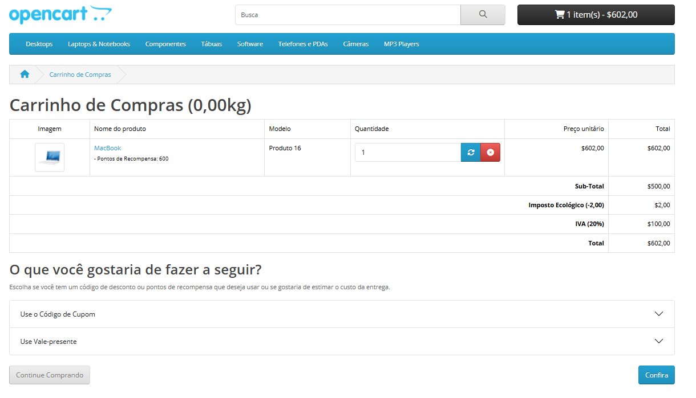

## Feature: TC_CART_001 - Gerenciamento de Carrinho de Compras 

Ambiente: Web/Edge/Windows

Pré-condição: Usuário acessar página inicial da Opencart.  

Passos:
1. Acessar site Opencart. 
2. Clicar em adicionar ao meu carrinho em um produto específico 
3. Clicar em **Meu Carrinho**    
**Regra de Negócio**

O sistema deve permitir que o usuário adicione produtos ao carrinho, visualize os itens 
selecionados e atualize ou remova produtos, garantindo que apenas itens válidos e disponíveis 
sejam mantidos no carrinho antes da finalização da compra.      

Testes Funcionais - Fluxo Principal   

**TC_001.**  Adicionar produto ao carrinho   
**Resultado Esperado:** : Ao clicar em "Adicionar ao carrinho", o sistema deve incluir o produto no 
carrinho do usuário.  

**Resultado Obtido:** Sistema adicionou o produto ao carrinho com sucesso.  

**Status: PASS**   

**TC_002.** Visualizar produto no carrinho   

**Resultado Esperado:** Ao acessar o carrinho, o sistema deve exibir o produto previamente 
adicionado.  

**Resultado Obtido:** Produto exibido corretamente no carrinho.  

**Status: PASS**   

**TC_003.**  Prosseguir para checkout  

**Resultado Esperado:** Ao clicar em "Confirmar compra" ou "Checkout", o sistema deve 
redirecionar o usuário para a página de finalização da compra.  

**Resultado Obtido:** N/A - O site de teste não permite prosseguir para o checkout.  

**Status: BLOCKED**   

**TC_004.** Remover produto do carrinho  

**Resultado Esperado:** O sistema deve remover o produto selecionado do carrinho.  

**Resultado Obtido:**  Produto removido com sucesso do carrinho.  

**Status: PASS**   

**TC_005.** Alterar quantidade de produto no carrinho  

**Resultado Esperado:**  O sistema deve permitir alterar a quantidade do produto e atualizar o 
carrinho corretamente.  

**Resultado Obtido:**  Sistema permitiu a alteração da quantidade com sucesso.  

**Status: PASS**   

**TC_006.** Carrinho vazio após remoção de item  

**Resultado Esperado:** Quando houver um único produto no carrinho e o mesmo for removido o carrinho deve ficar vazio.  

**Resultado Obtido:** Carrinho ficou vazio após a remoção do produto.  

**Status: PASS**   

**TC_007.** Remover um produto quando há múltiplos itens no carrinho  

**Resultado Esperado:**  Ao remover um dos produtos, o sistema deve atualizar o carrinho 
exibindo apenas os itens restantes.  

**Resultado Obtido:**  Sistema removeu corretamente o produto selecionado e atualizou os itens 
restantes no carrinho.  

**Status: PASS**   

**TC_008.** Adicionar múltiplos produtos ao carrinho  

**Resultado Esperado:** O sistema deve permitir adicionar mais de um produto diferente ao 
carrinho.  

**Resultado Obtido:** O sistema permitiu adicionar mais produtos distintos ao carrinho com 
sucesso.  

**Status: PASS**   

Fluxos Alternativo   

Validação do Carrinho   

**TC_009.** Atualização de preço ao adicionar ou remover produtos  

**Resultado Esperado:** O valor total do carrinho deve ser atualizado automaticamente ao 
adicionar ou remover produtos.  

**Resultado Obtido:** O sistema atualizou corretamente o valor total após alterações no carrinho.  

**Status: PASS**   

**TC_010.** Verificar persistência do carrinho após atualizar ou reabrir a página  

**Resultado Esperado:** : O sistema deve manter os produtos previamente adicionados ao carrinho 
mesmo após o usuário atualizar a página ou fechar e abrir o site novamente dentro da mesma 
sessão.  

**Resultado Obtido:**  Após atualizar a página e também após fechar e abrir novamente o site, os 
produtos permaneceram no carrinho corretamente.  

**Status: PASS**   

## Evidência  
   
