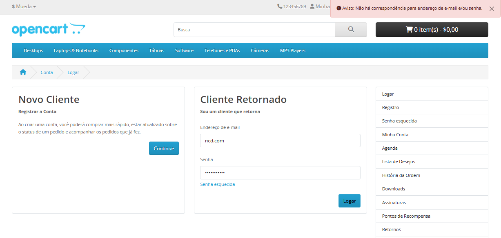
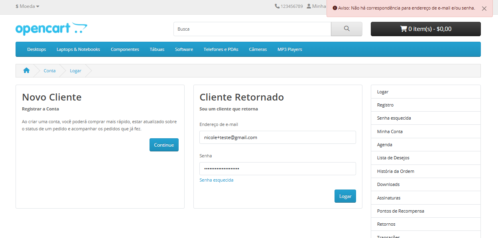
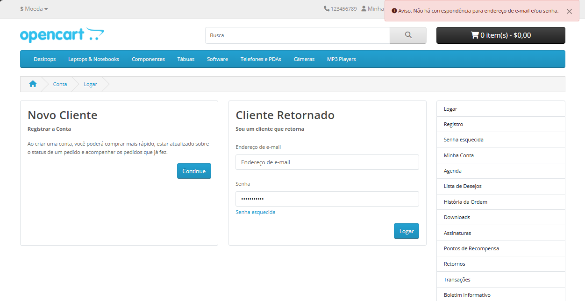
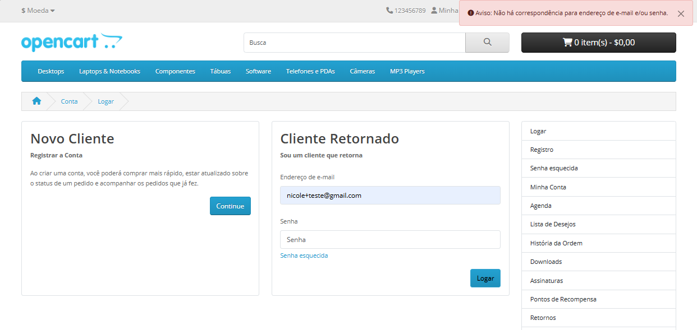

## Feature: Login de Usuário

Ambiente: Web/Edge/Windows

Pré-condição: Usuário acessar área de login da Opencart.  

### Test Data
E-mail válido: vitoria@gmail.com  
Senha válida: Entrar123* 

Passos:
1.  Acessar site da Opencart
2.  Clicar em minha conta
3.  Clicar em entrar
4.  Informar e-mail válido previamente cadastrado no campo "E-mail" conforme Test Data
5.  Informar senha válida no campo "Senha" conforme Test Data
6.  Clicar em "Entrar"

**Regra de Negócio**

O sistema deve permitir o acesso à conta apenas quando o usuário informar credenciais válidas 
(e-mail e senha cadastrados corretamente), bloqueando o login e exibindo mensagem 
apropriada quando as informações forem inválidas ou estiverem incompletas.      

Testes Funcionais - Fluxo Principal   

**TC_001.** Realizar login com credenciais válidas (e-mail e senha cadastrados)  

**Resultado Esperado:** O sistema deve autenticar o usuário com credenciais válidas, redirecionar para a página "Minha Conta" e exibir elementos que indiquem que o usuário está logado (ex: opção "Logout"). 

**Resultado Obtido:** Sistema autenticou o usuário com sucesso, redirecionando para a página "Minha Conta".  

**Status: PASS**   

### Evidência  

   

Fluxo Alternativo   

**TC_002.** Inserir e-mail inválido no campo e-mail  

**Resultado Esperado:** Sistema não deve autenticar o login e deve exibir mensagem de erro informando que o e-mail ou senha 
são inválidos.  

**Resultado Obtido:** Sistema não autenticou o login e exibiu mensagem "não há correspondência para e-mail ou senha", impedindo acesso a conta.  

**Status: PASS**   

### Evidência
   

**TC_003.** Inserir senha inválida no campo senha  

**Resultado Esperado:** O sistema não deve autenticar o usuário e deve exibir mensagem de erro informando que o e-mail ou senha são inválidos. 

**Resultado Obtido:** Sistema não autenticou o usuário e exibiu mensagem "não há correspondência para e-mail ou senha".  

**Status: PASS**   
### Evidência
   

Validação de campos   

**TC_004.** Tentar realizar login com campo e-mail vazio  

**Resultado Esperado:** Sistema não deve autenticar o usuário quando o campo e-mail estiver 
vazio e deve exibir mensagem informando que os dados são inválidos ou obrigatórios.  

**Resultado Obtido:**  Sistema não permitiu o login com o campo e-mail vazio e exibiu mensagem 
de erro informando que não há correspondência para e-mail ou senha impedindo o acesso.  

**Status: PASS**   
### Evidência
   

**TC_005.** Tentar realizar login com campo senha vazio  

**Resultado Esperado:** Sistema não deve autenticar o usuário quando o campo senha estiver 
vazio e deve exibir mensagem informando que os dados são inválidos ou obrigatórios.  

**Resultado Obtido:**  Sistema não permitiu o login com o campo senha vazio e exibiu mensagem 
de erro informando que não há correspondência para e-mail ou senha impedindo o acesso. 

**Status: PASS**   
### Evidência
   

Teste de Segurança / Regra de Proteção de Conta   

**TC_006.** Verificar limite de tentativas de login com senha incorreta (proteção contra múltiplas 
tentativas)  

**Resultado Esperado:** O sistema deve limitar o número de tentativas consecutivas de login com credenciais inválidas (ex: 5 tentativas), bloqueando temporariamente a conta ou exigindo verificação adicional.
 

**Resultado Obtido:** O sistema permite tentativas ilimitadas de login com credenciais inválidas, sem qualquer bloqueio ou mecanismo de proteção.
 

**Impacto:** A ausência desse controle aumenta significativamente o risco de ataques de força bruta.

**Status: Fail**  

**Bug relacionado:** BUG02_Login_Tentativas_Ilimitadas.md

**Severidade**  
**Alta**

**Prioridade**  
**Alta**

