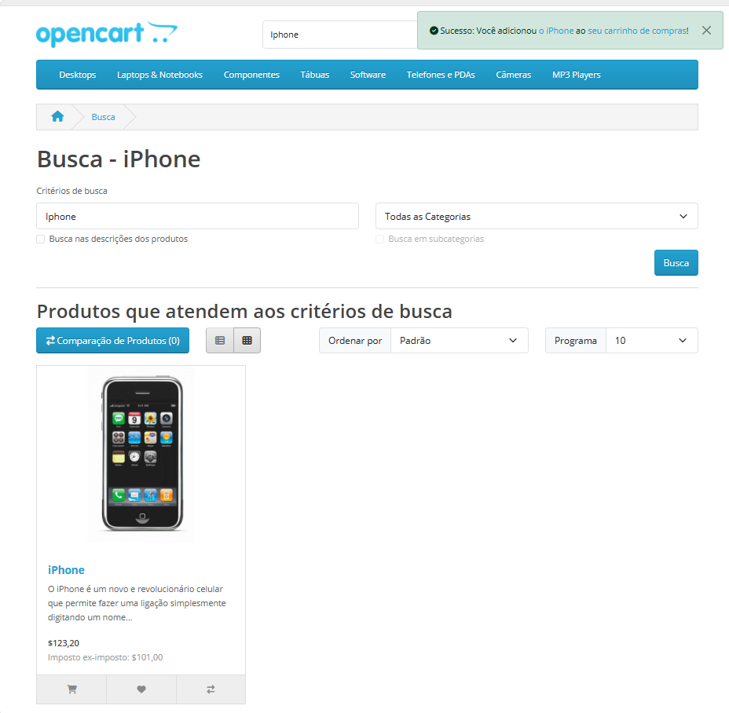
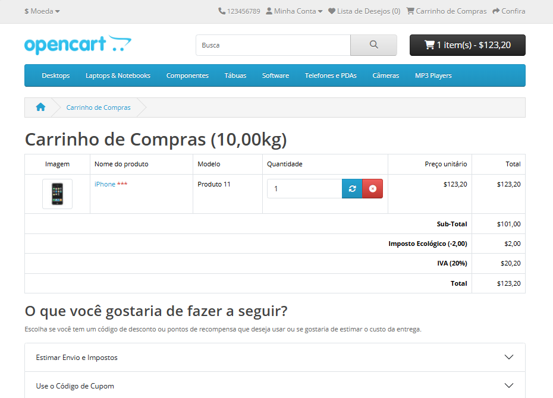
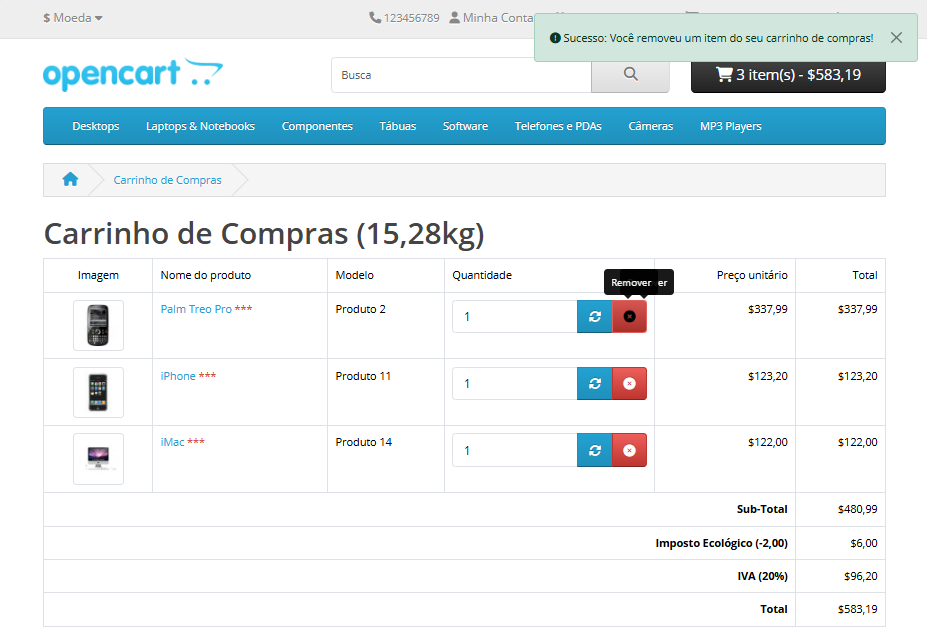
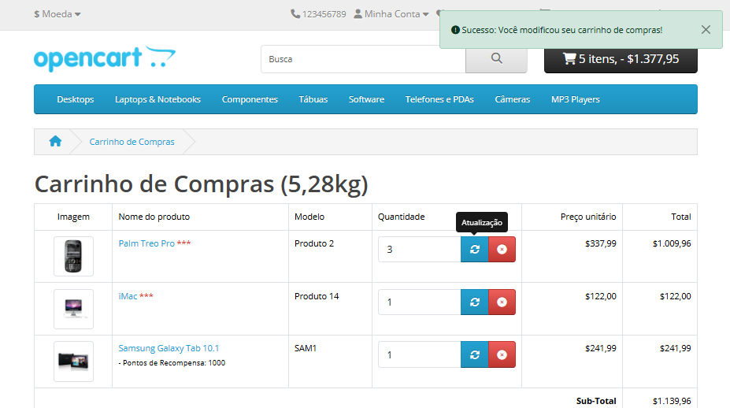
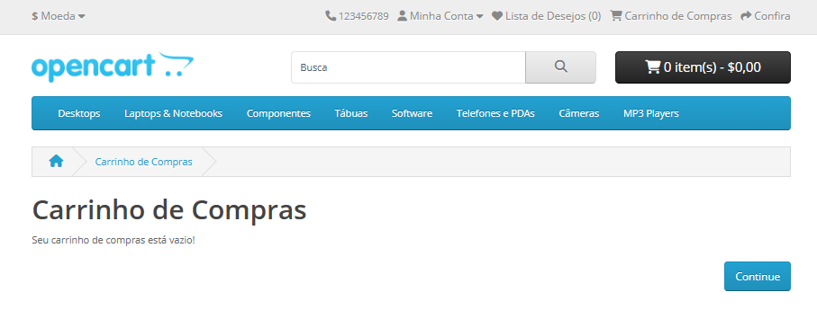
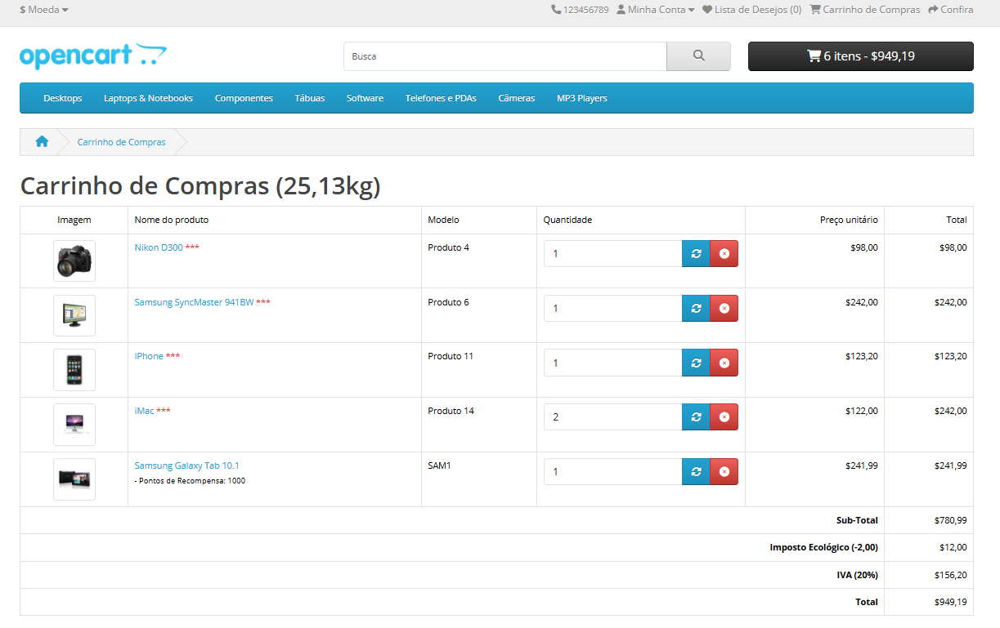
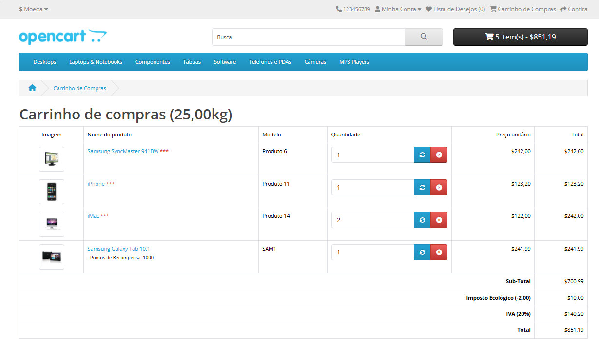
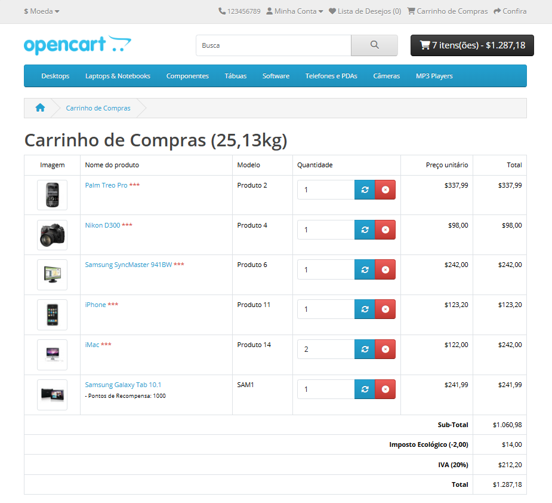
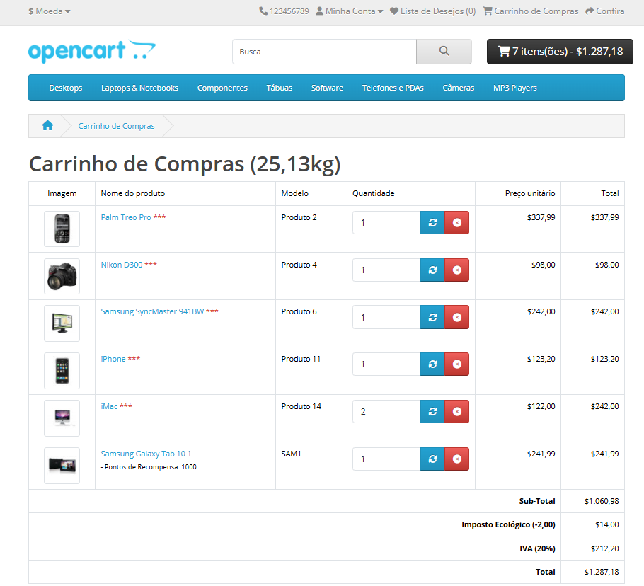

## Feature: Gerenciamento de Carrinho de Compras 

Ambiente: Web/Edge/Windows

Pré-condição: Usuário acessar página inicial da Opencart.  

**Test Data**

Produto: iPhone  
Quantidade Inicial: 1  
Quantidade Alterada: 3  

Passos:
1. Acessar o site Opencart
2. Selecionar um produto
3. Clicar em "Adicionar ao carrinho"
4. Acessar "Meu Carrinho"    
**Regra de Negócio**

O sistema deve permitir que o usuário adicione produtos ao carrinho, visualize os itens 
selecionados e atualize ou remova produtos, garantindo que apenas itens válidos e disponíveis 
sejam mantidos no carrinho antes da finalização da compra.      

Testes Funcionais - Fluxo Principal   

**TC_001.**  Adicionar produto ao carrinho   
**Resultado Esperado:** O sistema deve adicionar o produto ao carrinho, atualizar o contador de itens e exibir mensagem de sucesso confirmando a ação.  

**Resultado Obtido:** O sistema adicionou o produto ao carrinho, atualizou o contador e exibiu a mensagem: "Sucesso: Você adicionou o iPhone ao seu carrinho de compras!".  

**Status: PASS**   

### Evidência
**Mensagem de Produto Adicionado**   

  

**TC_002.** Visualizar produto no carrinho   

**Resultado Esperado:** O sistema deve exibir o produto adicionado no carrinho, apresentando informações como nome, preço e quantidade, além de permitir alteração ou remoção.  

**Resultado Obtido:** O produto foi exibido corretamente no carrinho, com opções de alterar quantidade e remover. 

**Status: PASS**   

### Evidência
**Confirmação de produto adicionado**  

  

**TC_003.**  Prosseguir para checkout  

**Resultado Esperado:** O sistema deve redirecionar o usuário para a página de checkout, solicitando dados de endereço e pagamento. 

**Resultado Obtido:** N/A – Funcionalidade de checkout indisponível no ambiente de teste  

**Status: BLOCKED**  

**Motivo:** Funcionalidade não disponível no ambiente.   

**TC_004.** Remover produto do carrinho  

**Resultado Esperado:** O sistema deve remover o produto selecionado do carrinho e exibir mensagem de confirmação.  

**Resultado Obtido:** O sistema removeu o produto com sucesso e exibiu a mensagem: "Sucesso: Você removeu um item do seu carrinho de compras!".  

**Status: PASS**   

### Evidência

  

**TC_005.** Alterar quantidade de produto no carrinho  

**Resultado Esperado:** O sistema deve permitir alterar a quantidade do produto e atualizar o carrinho, recalculando valores e exibindo mensagem de confirmação.  

**Resultado Obtido:** O sistema atualizou a quantidade corretamente e exibiu a mensagem: "Sucesso: Você modificou seu carrinho de compras!".  

**Status: PASS**   

### Evidência

  

**TC_006.** Carrinho vazio após remoção de item  

**Resultado Esperado:** Ao remover todos os itens, o sistema deve exibir mensagem indicando que o carrinho está vazio.  

**Resultado Obtido:** O carrinho ficou vazio e exibiu a mensagem: "Seu carrinho de compras está vazio!".  

**Status: PASS**   

### Evidência

  

**TC_007.** Remover um produto quando há múltiplos itens no carrinho  

**Resultado Esperado:** O sistema deve remover apenas o item selecionado e manter os demais produtos no carrinho, atualizando o contador e preços. 

**Resultado Obtido:** O sistema removeu corretamente o item selecionado, manteve os demais produtos no carrinho atualizando o contador e preços com sucesso.  

**Status: PASS**   

### Evidência 
**Antes**  
  

**Depois**  
  

**TC_008.** Adicionar múltiplos produtos ao carrinho  

**Resultado Esperado:** O sistema deve permitir adicionar diferentes produtos ao carrinho simultaneamente.  

**Resultado Obtido:** O sistema permitiu adicionar múltiplos produtos distintos ao carrinho com sucesso.  

**Status: PASS**   

### Evidência

  

Fluxos Alternativo - Validação de Carrinho   

**TC_009.** Atualização de preço, peso e quantidade ao adicionar ou remover produtos  

**Resultado Esperado:** O sistema deve atualizar automaticamente o valor total, a quantidade de itens e o peso total do carrinho sempre que um produto for adicionado, removido ou tiver sua quantidade alterada.  

**Resultado Obtido:** O sistema atualiza corretamente o valor total e a quantidade de itens. No entanto, foi identificado que, para **alguns produtos**, o peso total do carrinho não é atualizado após alterações.  

O comportamento não ocorre de forma consistente para todos os itens, indicando possível falha associada a produtos específicos ou regras de cálculo.

Essa inconsistência pode impactar diretamente o cálculo de frete, emissão de nota fiscal e processos logísticos, especialmente em cenários onde o peso influencia restrições de transporte (ex: transporte aéreo). 

**Status: Fail**  

**Observação:**  

Recomenda-se identificar quais produtos apresentam o problema e validar possíveis diferenças em atributos como peso cadastrado, tipo de produto ou regras específicas aplicadas.  

**Bug relacionado:** BUG02_Peso_de_Itens_do_Carrinho_Não_Atualiza

**Severidade:**  
Alta  

**Prioridade:**  
Alta   

### Evidência
**Antes** 
  

**Depois**
  

**TC_010.** Verificar persistência do carrinho após atualizar ou reabrir a página  

**Resultado Esperado:** O sistema deve manter os produtos no carrinho após atualização da página ou reabertura do site durante a mesma sessão. 

**Resultado Obtido:** Os produtos permaneceram no carrinho após atualização e reabertura do site.  

**Status: PASS**   

## Evidência  
   

