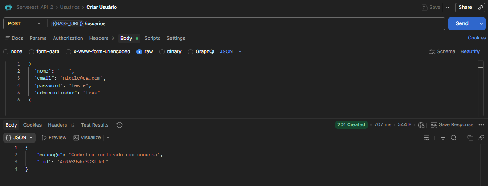

**Origem:** TC03_POST_Usuario_com_ausencia_de_dados_obrigatorios.md  

### ID do Bug: BUG03_POST_API_permite_cadastro_com_nome_composto_apenas_por_espacos
Título: POST em /usuarios permite cadastro com nome composto apenas por espaços em branco.   

Tipo: BUG Funcional API  
Ferramenta usada: Postman  
API Endpoint: /usuarios  
Método HTTP: POST  
Tipo de teste: Negativo API Test   

### Ambiente

Ambiente: API pública de testes  
Ferramenta: Postman  
Data do teste: 01/05/2026 

### Pré-condição

API disponível e funcional.  

### Passos para Reproduzir
1. Enviar uma requisição POST para o endpoint /usuarios. 
2. Informar um e-mail válido. 
3. Definir o campo "nome" como " " (apenas espaços em branco). 
4. Informar uma senha válida. 
5. Executar a request.  

### Resultado Esperado

A API deveria validar o campo nome e rejeitar valores compostos apenas por espaços em branco.

Status Code: 400 (Bad Request)

Mensagem de erro indicando que o campo nome é obrigatório ou inválido.   

### Resultado Obtido

A API permitiu o cadastro do usuário e retornou Status Code: 201 (Created)

Mensagem: "Cadastro realizado com sucesso"

Isso indica falha na validação do campo nome, permitindo entrada inválida.  

### Observação Adicional

Foi identificado comportamento inconsistente na validação do campo nome

Quando o campo "nome" é enviado vazio (""), a API retorna corretamente erro 400 (Bad Request)

Porém, quando o campo é enviado com apenas espaços (" "), a API aceita a requisição e realiza o cadastro normalmente 201 (Created)

Esse comportamento indica ausência de tratamento de espaços em branco (trim) antes da validação.  

**Severidade**  
Média

**Prioridade**  
Média   

Evidência  
 
