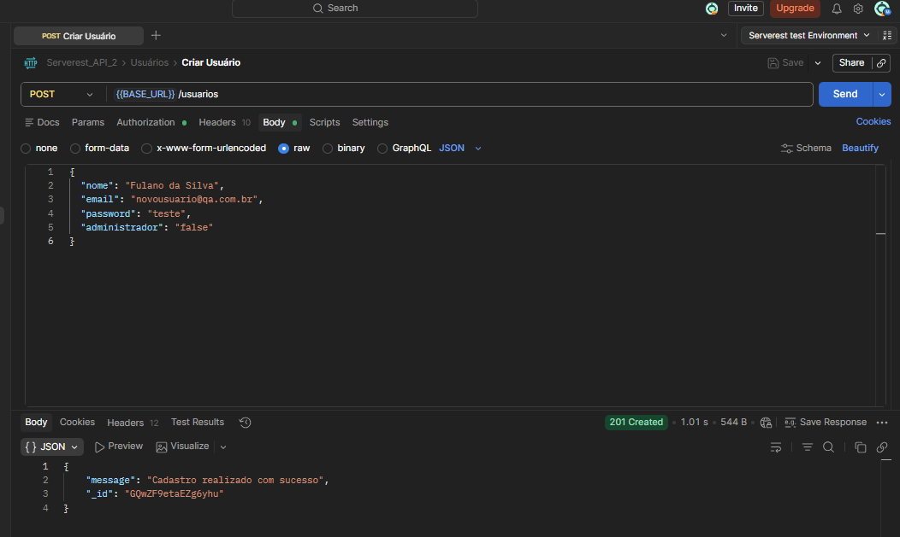
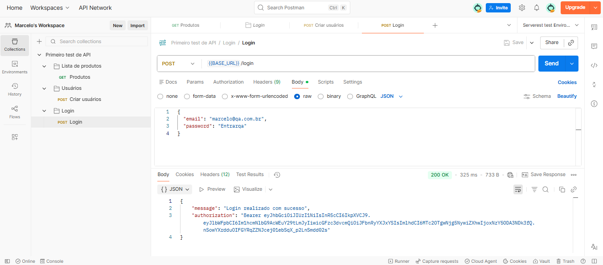
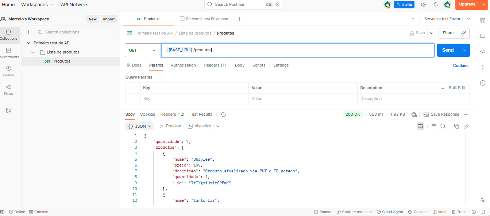
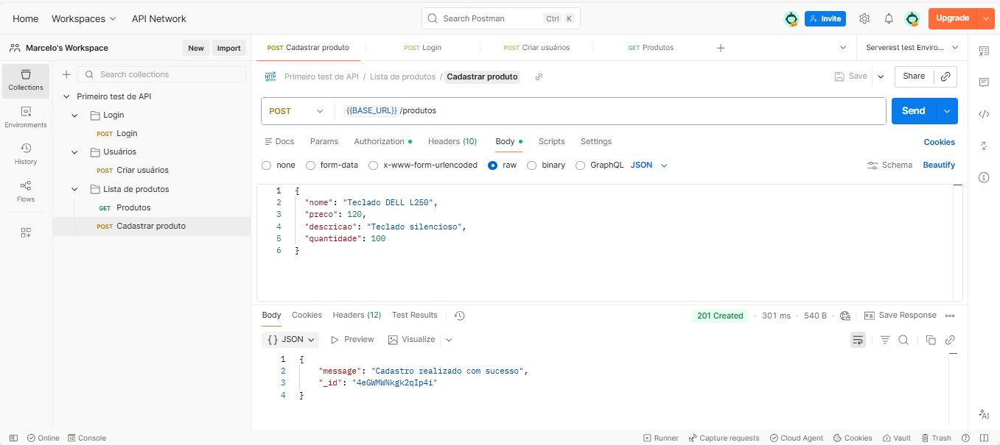
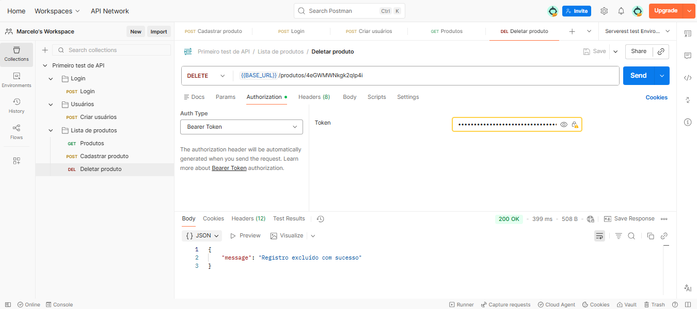

# Sistema: E-commerce API  

**Ferramenta:** Postman  

**Tipo de teste:** Funcional - API   

**Fluxo Principal**   

### TC01- POST- Criar Usuário  

**ID:** API_POST_USER_001  

**Título:** Validar criação de usuário com dados válidos  

**Método:** POST  

**Endpoint:** /usuarios   

### Regra de Negócio  

O sistema deve permitir a criação de usuários quando os dados obrigatórios forem informados.  

### Passos  

1. Enviar request POST com dados válidos do usuário  

### Input (body)
{ 
“name” : “ Fulano da Silva ”, 
“e-mail” “novousuario@qa.com”, 
“password” :  “teste”, 
"Admin": "true" ou "false"  
} 

### Resultado Esperado 

Status code **201**

Usuário criado com sucesso  

### Resultado Obtido 

Status code **201**

Usuário criado com sucesso 

**Status:** Pass   

## Evidência  
### Cadastro com Sucesso
   

### TC02 - POST - Login

**ID:** API_POST_LOGIN_001  

**Título:** Validar login com credenciais válidas

**Método:** POST

**Endpoint:** /login

### Regra de Negócio
O sistema deve autenticar o usuário quando as credenciais forem válidas.  

### Passos

1. Enviar request POST com e-mail e senha válidos  

### Input (body)
{ 
“e-mail”: “nicole@gmail.com”, 
“password” :  “1234”, 
} 

### Resultado Esperado 
Status code **200**

Retorna o Token de autenticação  

### Resultado Obtido 
Status code **200**

Token de autenticação gerado com sucesso

**Status:** Pass   

## Evidência
### Login com Sucesso
   

### TC03 - GET - Lista de produtos

**ID:** API_GET_PROD_001

**Título:** Validar listagem de produtos cadastrados

**Método:** GET

**Endpoint:** /produtos

### Regra de Negócio 

O sistema deve retornar a lista de produtos cadastrados quando a request for válida.  

### Pré-condições 

* API disponível
* Existirem produtos cadastrados
  
### Passos

1. Enviar uma request GET para o endpoint /produtos

### Resultado Esperado 

Status code **200**

Retornar lista de produtos em formato JSON

Cada produto deve conter:

Nome  
Preço  
Descrição  
Quantidade  
id  

### Resultado Obtido

Status code **200**

Lista retornada corretamente.

**Status:** Pass   

## Evidência  
### Listagem de Produtos com Sucesso
   

### TC04 - POST - Cadastrar Produto

**ID:** API_POST_PROD_001

**Título:** Validar cadastro de novo produto com dados válidos 

**Método:** POST

**Endpoint:** /produtos 

### Regra de Negócio

O sistema deve permitir o cadastro de produtos quando todos os campos obrigatórios forem 
informados corretamente. 

### Pré-condições 

* Usuário autenticado 
* Token válido

### Passos

1. Enviar request POST com dados válidos do produto

### Input (body)
{ 
"title": "Teclado DELL L250", 
"price": 120, 
"description": "Teclado silencioso", 
"quantity" : 100 , 
} 

### Resultado Esperado

Status code **201**

Produto criado com sucesso 

Retornar ID do produto criado

### Resultado Obtido

Status code **201**

Produto cadastrado conforme esperado.

**Status:** Pass   

## Evidência
### Cadastro de Produto com Sucesso
   

### TC05 - DELETE - Deletar Produto
**ID:** API_DEL_PROD_001

**Título:** Validar exclusão de produto existente

**Método:** DELETE

**Endpoint:** /produtos/ { id }

### Regra de Negócio
O sistema deve permitir a exclusão de um produto existente quando o ID informado for válido.

### Pré-condições

* Produto existente 
* Usuário autenticado

### Passos 

Enviar uma request DELETE informando o ID do produto.

### Resultado Esperado

Status code **200**

Produto removido com sucesso 

### Resultado Obtido

Status code **200**

Produto deletado conforme esperado 

**Status:** Pass   

## Evidência
### Deletar Produto com Sucesso
   

