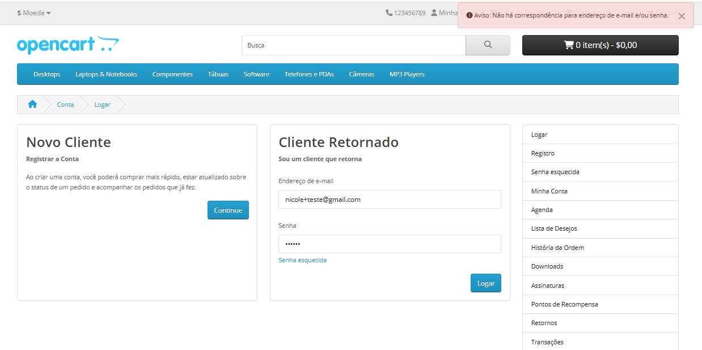
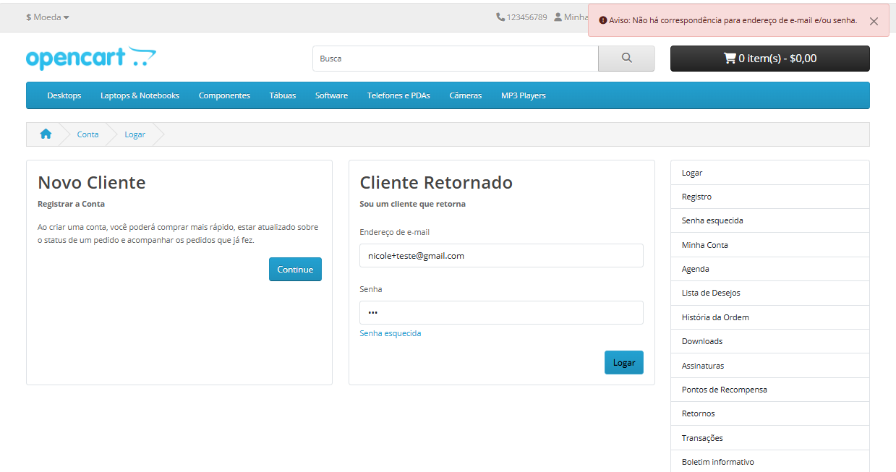
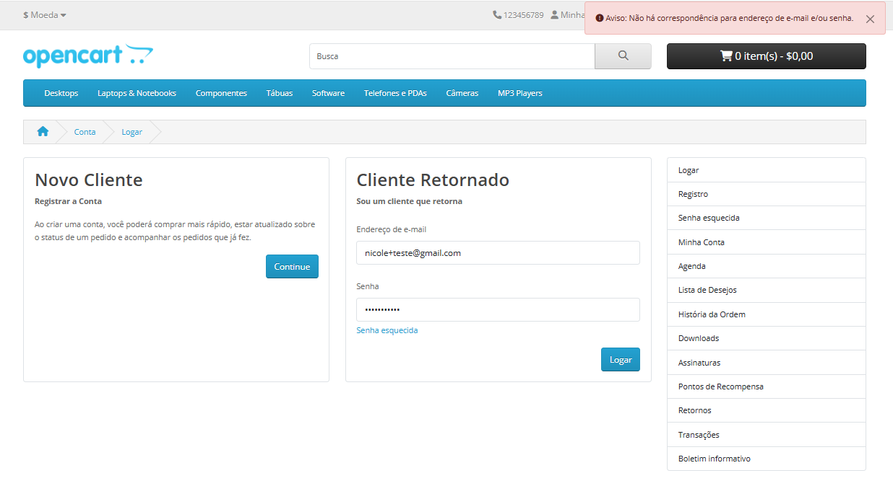
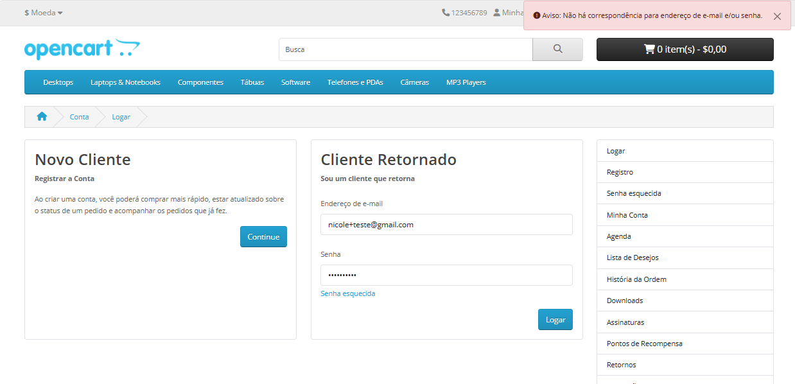
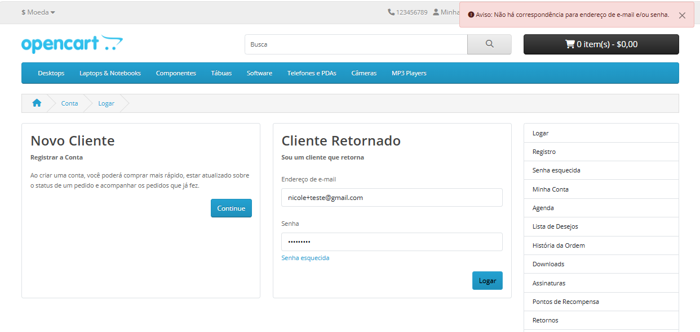
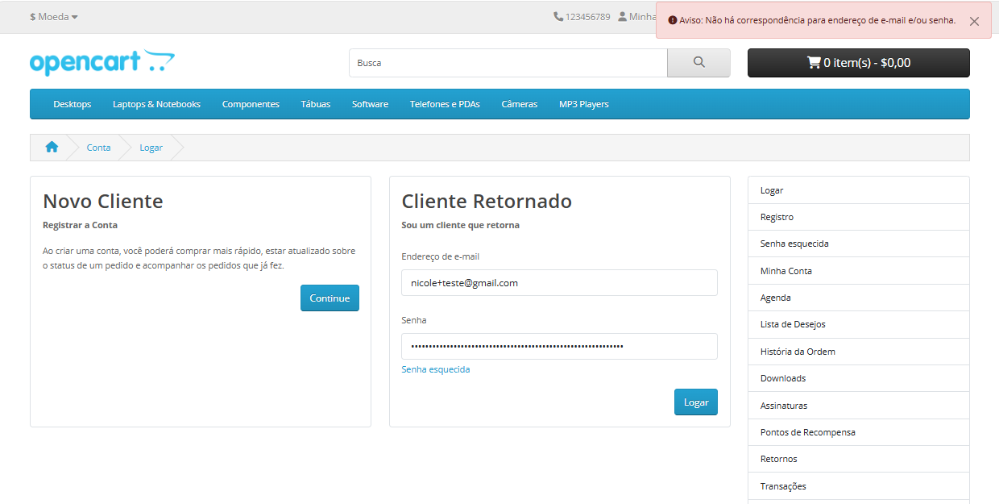

**Origem:** TC02 - Login_de_Usuário.md

### Bug ID: BUG01_Login_Tentativas_Ilimitadas

Título: Sistema permite tentativas ilimitadas de login com senha incorreta.  
Tipo: BUG  
Categoria: Segurança / Funcional  
Ambiente:  Web / Navegador Edge / Windows  
Tipo de teste: Teste Manual / Funcional   

**Ambiente**

Ambiente: Sistema público de E-commerce  
Data do teste: 28/04/2026   

**Pré-condição**  

Usuário possuir conta previamente cadastrada e acessar a página de login.  

**Passos para Reproduzir**

1. Acessar a página de login 
2. Inserir e-mail válido previamente cadastrado  
3. Inserir senha incorreta 
4. Clicar em “Entrar“ 
5. Repetir o processo de 2 à 5 vezes consecutivas 

**Resultado Esperado**

O sistema deve limitar o número de tentativas consecutivas de login inválidas (ex: 5 tentativas), bloqueando temporariamente o acesso ou exigindo verificação adicional.

**Resultado Obtido**

O sistema permite tentativas ilimitadas de login com senha incorreta, sem qualquer bloqueio ou mecanismo de proteção.

**Observação**

Durante a execução do teste, foram realizadas múltiplas tentativas consecutivas de login com senha incorreta, sem que o sistema aplicasse qualquer tipo de bloqueio ou limitação.

**Impacto**

A ausência de limitação de tentativas de login pode expor o sistema a ataques de força bruta, aumentando o risco de comprometimento de contas de usuários.

**Severidade** 
Alta

**Prioridade** 
Alta

**Evidências** 

Tentativa_1 

 
Tentativa_2 

 
Tentativa_3 

 
Tentativa_4 

 
Tentativa_5 

 
Tentativa_6 

 

