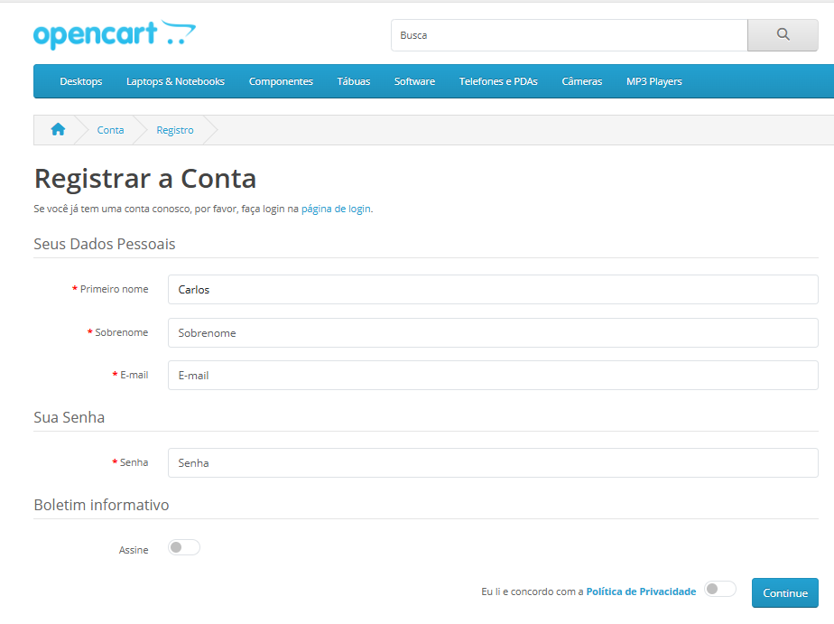
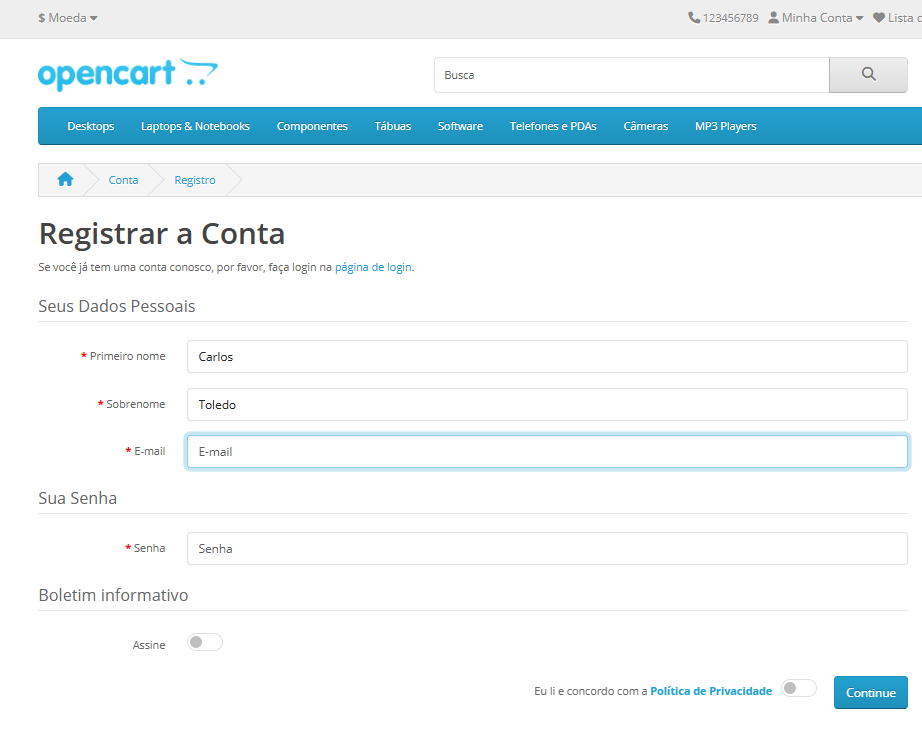

## Feature: Cadastro de Usuário

Ambiente: Web/Edge/Windows

Pré-condição: Usuário acessar página inicial da Opencart 

### Test Data
Nome: Fernando (Formato válido Texto alfabético)     
Sobrenome: Oliveira (Formato válido Texto alfabético)   
E-mail: fernandoteste@gmail.com (Formato Válido)  
Senha: Entrar1234* (mín. 4 caracteres, com maiúscula, número e símbolo)   

Passos:
1. Clicar em minha conta 
2. Clicar em cadastrar
3. Inserir um nome válido no campo "Primeiro Nome" conforme Test Data
4. Inserir um sobrenome válido no campo “Sobrenome” conforme Test Data
5. Inserir um email válido conforme Test Data
6. Inserir uma senha válida conforme Test Data
7. Confirmar a senha no campo “Confirmar Senha”
8. Marcar o checkbox “Política de Privacidade”
9. Clicar no botão “Continue”    
**Regra de Negócio**

O sistema deve permitir a criação de uma conta apenas quando todos os campos obrigatórios 
(Nome, Sobrenome, E-mail e Senha) forem preenchidos com dados válidos, respeitando as 
regras de validação definidas para cada campo.      

**Testes Funcionais - Fluxo Principal**   

### **TC_001.** Inserir nome válido no campo "Nome"   
**Resultado esperado:** O sistema deve aceitar o nome inserido, não exibir mensagens de erro e permitir a continuidade do preenchimento do formulário de cadastro.  

**Resultado Obtido:** O sistema aceitou o nome inserido sem apresentar mensagens de erro e permitiu a continuidade do cadastro. 

**Status: PASS**   

### Evidência

### **TC_002.** Inserir sobrenome válido no campo "Sobrenome"   

**Resultado esperado:** O sistema deve aceitar o sobrenome inserido, não exibir mensagens de erro e permitir a continuidade do cadastro. 

**Resultado Obtido:** O sistema aceitou o sobrenome inserido sem apresentar mensagens de erro e permitiu a continuidade do cadastro. 

**Status: PASS**   

### Evidência

### **TC_003.** Inserir e-mail válido no campo "E-mail"  

**Resultado esperado:** O sistema deve aceitar o e-mail inserido no formato válido, não exibir mensagens de erro e permitir a continuidade do cadastro. 

**Resultado Obtido:** O sistema aceitou o e-mail inserido sem apresentar mensagens de erro e permitiu a continuidade do cadastro.  

**Status: PASS**   

### Evidência

### **TC_004.** Inserir senha com caracteres válidos  

**Resultado esperado:** O sistema deve aceitar a senha inserida conforme os critérios mínimos definidos, não exibir mensagens de erro e permitir a conclusão do cadastro.  

**Resultado Obtido:** O sistema aceitou a senha inserida sem apresentar mensagens de erro e permitiu a conclusão do cadastro.  

**Status: PASS**   

### Evidência
   

**Fluxo Alternativo**   

### **TC_005.** Deixar o campo "Nome" em branco  

**Resultado esperado:** O sistema deve impedir a continuidade do cadastro e exibir uma mensagem clara informando que o campo é obrigatório.  

**Resultado Obtido:** O sistema bloqueou a continuidade do cadastro e exibiu mensagem solicitando o preenchimento do campo obrigatório. 

**Status: PASS**   

### Evidência

### **TC_006.** Deixar o campo "Sobrenome" em branco  

**Resultado esperado:** O sistema deve impedir a continuidade do cadastro e exibir uma mensagem clara informando que o campo é obrigatório.  

**Resultado Obtido:** O sistema bloqueou a continuidade do cadastro e exibiu mensagem solicitando o preenchimento do campo obrigatório. 

**Status: PASS**   

### Evidência

### **TC_007.** Deixar o campo "Senha" em branco  

**Resultado esperado:** O sistema deve impedir a continuidade do cadastro e exibir uma mensagem clara informando que o campo é obrigatório.  

**Resultado Obtido:**  O sistema bloqueou a continuidade do cadastro e exibiu mensagem solicitando o preenchimento do campo obrigatório. 

**Status: PASS**   

### Evidência

Validação de Campos   

### **TC_008.** Inserir números nos campo "Nome"  

**Resultado esperado:** O sistema deve aceitar valores no campo nome conforme regra definida (não especificada). 

**Resultado Obtido:** O sistema permitiu a inserção de números nos campos "Nome" e "Sobrenome" e aprovou a criação do cadastro sem exibir mensagens de validação. 

**Status: pass**  

**Observação:**
O campo nome aceita caracteres numéricos. Não há definição clara de regra de validação para este campo. Validar com o time se há restrição esperada.   

### Evidência  

   

   

### **TC_009.** Inserir e-mail inválido no campo "E-mail"  

**Resultado esperado:** O sistema deve impedir a criação do cadastro e exibir uma mensagem de erro informando que o e-mail inserido é inválido. 

**Resultado Obtido:**  O sistema não concluiu o cadastro, porém não exibiu nenhuma mensagem de erro informando o motivo da falha. 

**OBS:** Foi observado que, ao inserir um e-mail inválido no campo "E-mail", o sistema não 
apresenta nenhuma mensagem de validação ao usuário. A ausência de feedback pode gerar 
dúvida sobre o motivo pelo qual o cadastro não foi concluído. Recomenda-se a implementação 
de uma mensagem clara informando que é necessário inserir um e-mail válido para prosseguir 
com o cadastro.  

**Status: FAIL**   

### Evidências  
   

### **TC_010.** Inserir senha com apenas 1 caractere (ex: A ou 1)  

**Resultado esperado:** O sistema deve impedir a criação do cadastro e exibir mensagem informando os requisitos mínimos de senha.
 

**Resultado Obtido:** O sistema bloqueou a criação do cadastro ao identificar que a senha não atende aos requisitos mínimos e apresentou mensagem "A senha deve ter entre 4 e 20 caracteres!". 

**Status: PASS**   

### Evidência

