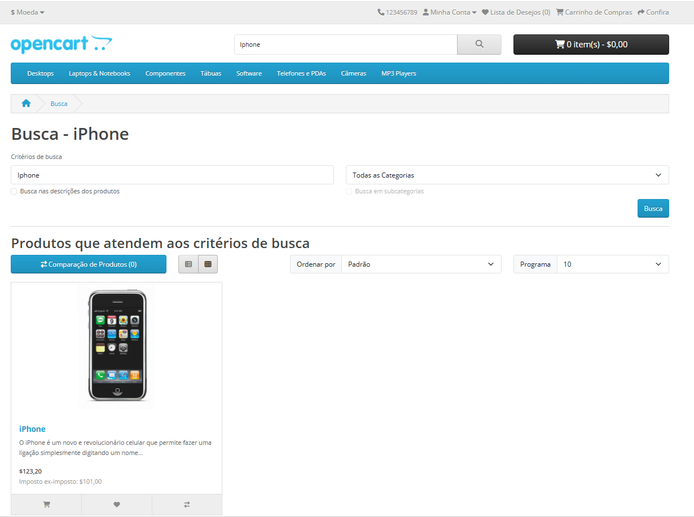
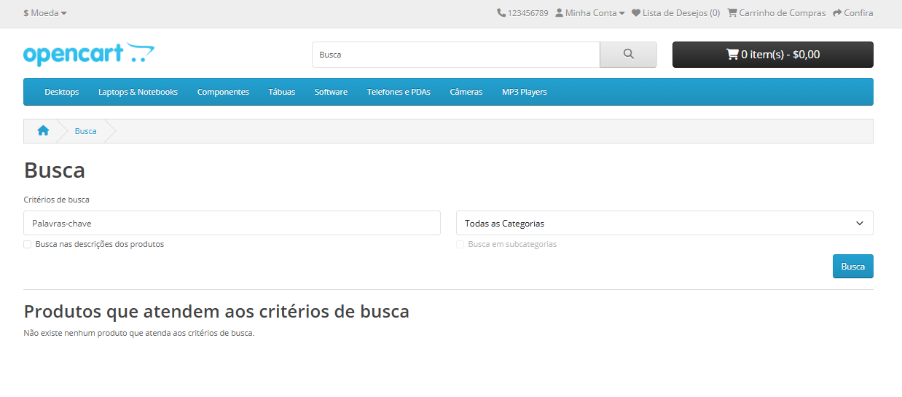
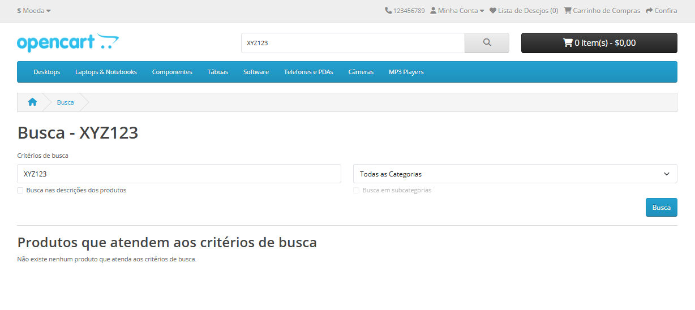
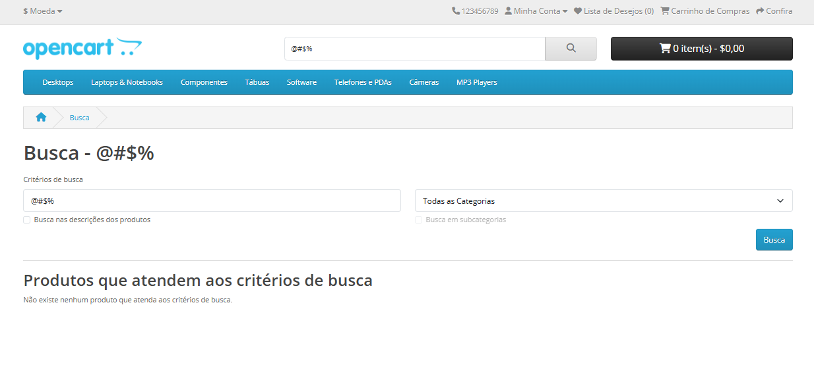
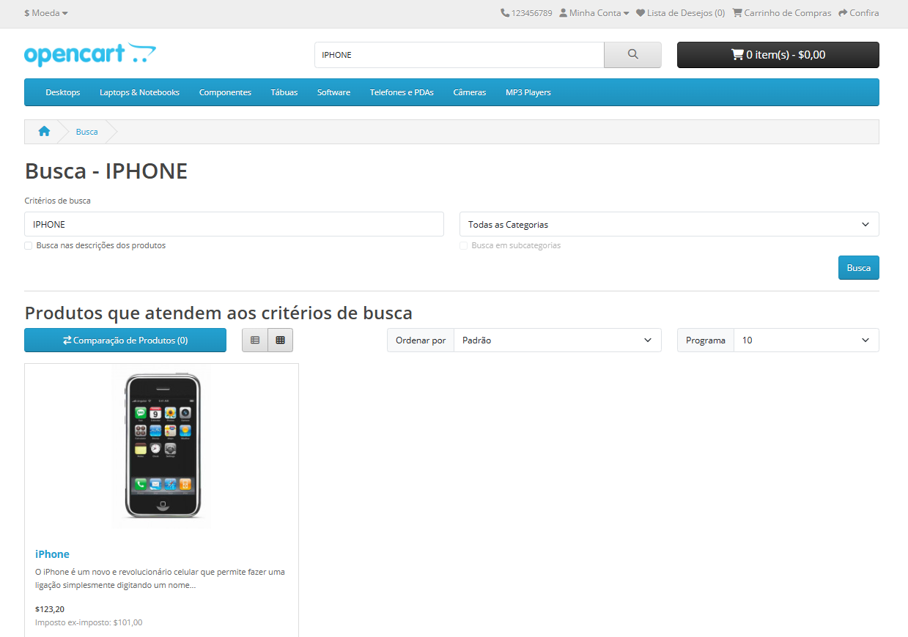
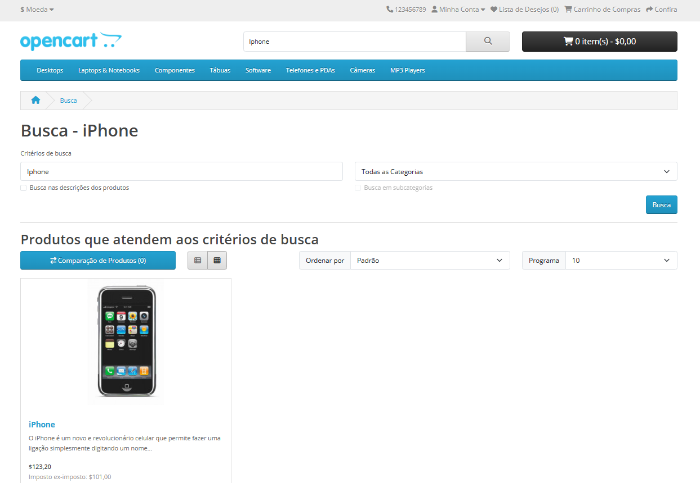

## Feature: Pesquisa por produtos

Ambiente: Web/Edge/Windows

Pré-condição:  Usuário acessar página inicial da Opencart.  

**Test Data** 

Pesquisa válida: Iphone 
Pesquisa inexistente: XYZ123 
Pesquisa com caracteres especiais: @#$%  
Pesquisa com espaços: "   " 
Pesquisa com variação: iphone / IPHONE 

Passos:
1. Clicar no campo de pesquisa 
2. Digitar termo conforme Test Data
3. Clicar em "pesquisar"   

**Regra de Negócio**

O sistema deve retornar produtos cujo nome ou descrição esteja relacionado ao termo digitado 
pelo usuário no campo de pesquisa.      

**Testes Funcionais - Fluxo Principal**   

### **TC_001.** Buscar produto pelo nome específico  

**Resultado Esperado:** O sistema deve exibir uma lista de produtos cujo nome ou descrição contenha o termo "Iphone", apresentando informações como nome, preço e imagem.  

**Resultado Obtido:** O sistema exibiu produtos relacionados ao termo "Iphone", incluindo nome, preço e imagem. 

**Status: PASS**   

### Evidência 

   

**Fluxo Alternativo**   

### **TC_002.** Realizar busca com campo vazio 

**Resultado Esperado:** O sistema não deve retornar resultados e pode exibir mensagem informando que nenhum termo foi inserido. 

**Resultado Obtido:** O sistema não retornou resultados para o campo vazio e apresentou mensagem "Não existe nenhum produto que atenda aos critérios de busca."  

**Status: PASS**   

### Evidência
   

### **TC_003.** Busca por termo inexistente (ex: XYZ123 )

**Resultado Esperado:** O sistema deve exibir mensagem informando que nenhum produto foi encontrado. 

**Resultado Obtido:** O sistema não retornou resultados para o termo pesquisado e apresentou mensagem "Não existe nenhum produto que atenda aos critérios de busca." 

**Status: PASS**   

### Evidência
   

### **TC_004.** Busca por caracteres especiais 

**Resultado Esperado:** O sistema não deve retornar resultados para caracteres inválidos e pode exibir mensagem informativa.  

**Resultado Obtido:** O sistema não retornou resultados para caracteres especiais e apresentou mensagem "Não existe nenhum produto que atenda aos critérios de busca."  

**Status: PASS**   

### Evidência
   

### **TC_005.** Diferenciação entre Maiúsculas e minúsculas

**Resultado Esperado:** O sistema deve retornar os mesmos resultados independentemente do uso de letras maiúsculas ou minúsculas. 

**Resultado Obtido:** O sistema retornou os mesmos resultados para "iphone" e "IPHONE".  

**Status: PASS**   

### Evidência
**Maiúsculas**  

    

### Evidência
**Minúsculas**  

   

### **TC_006.** Espaços extras 

**Resultado Esperado:** O sistema deve ignorar espaços extras antes ou depois do termo e retornar resultados normalmente.  

**Resultado Obtido:** O sistema retornou resultados corretamente mesmo com espaços extras no termo.  

**Status: PASS**   

